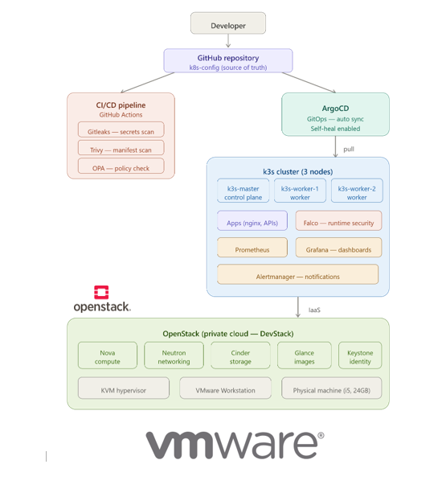
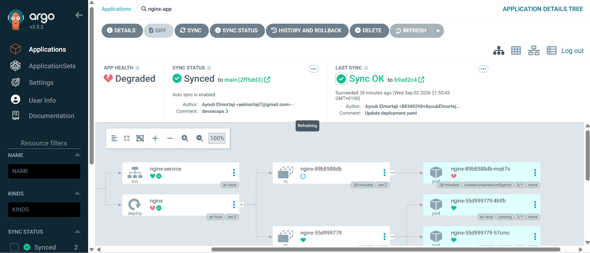

# PrivaSecOps — Private Cloud Platform with GitOps & DevSecOps

> A private cloud built from scratch on **OpenStack**, running a **Kubernetes (k3s)** cluster deployed through **GitOps (ArgoCD)**, with security enforced at every stage: **before** deployment (Gitleaks, Trivy, OPA), **at** deployment (Git as the single source of truth) and **after** deployment (Falco runtime detection), all monitored with **Prometheus and Grafana**.


---

## Table of contents

- [Why this project](#why-this-project)
- [Architecture](#architecture)
- [End-to-end flow](#end-to-end-flow)
- [Phase 1 — Private cloud: OpenStack + k3s](#phase-1--private-cloud-openstack--k3s)
- [Phase 2 — GitOps with ArgoCD](#phase-2--gitops-with-argocd)
- [Phase 3 — DevSecOps pipeline](#phase-3--devsecops-pipeline)
- [Phase 4 — Runtime security with Falco](#phase-4--runtime-security-with-falco)
- [Phase 5 — Observability](#phase-5--observability)
- [Phase 6 — Infrastructure as Code](#phase-6--infrastructure-as-code)
- [Results](#results)
- [Roadmap](#roadmap)
- [Related repository](#related-repository)
- [Documentation](#documentation)
- [Author](#author)

---

## Why this project

Most cloud-native security setups add security as a final check before production. This project treats it as a property of the whole lifecycle, on an infrastructure that is fully controlled, from the hypervisor up:

| Stage | Question it answers | Control |
|---|---|---|
| **Before deployment** (shift-left) | Is this change safe to merge? | Gitleaks, Trivy, OPA/Conftest gates in CI |
| **At deployment** (GitOps) | Does the cluster match exactly what was reviewed? | ArgoCD pull model, auto-sync, self-heal |
| **After deployment** (runtime) | Is something malicious happening inside a running container? | Falco syscall-level detection |
| **Continuously** | Is the platform healthy? | Prometheus, Grafana, Alertmanager |

## Architecture

<p align="center">
  
</p>

The platform is built in layers, each relying on the one below:

| Layer | Technology | Role |
|---|---|---|
| Observability | Prometheus · Grafana · Alertmanager | Metrics, dashboards, alerts |
| Runtime security | Falco | Syscall-level threat detection |
| GitOps | ArgoCD | Continuous deployment from Git |
| DevSecOps CI | GitHub Actions · Gitleaks · Trivy · OPA/Conftest | Security gates on every push |
| Orchestration | Kubernetes k3s (3 nodes) | Container scheduling |
| Private cloud | OpenStack DevStack (Keystone, Nova, Neutron, Glance, Cinder, Horizon) | IaaS: compute, network, storage |
| Hypervisor | KVM | Virtual machines inside OpenStack |
| Host | VMware Workstation · Ubuntu Server 22.04 | Nested virtualization (Intel VT-x) |

**Hardware:** a single laptop (Intel i5, 24 GB RAM). The DevStack VM gets 16 GB RAM, 4 vCPU and 150 GB of disk, and runs the k3s VMs through **nested virtualization** (VMware → KVM → k3s nodes).

## End-to-end flow

<p align="center">
  
</p>

1. A developer pushes a change to the [`k8s-config`](https://github.com/AyoubElmortaji/k8s-config) repository.
2. GitHub Actions runs the three security gates. **Any failure blocks the merge.**
3. Once merged, ArgoCD detects the change and syncs it to the cluster.
4. Kubernetes performs a rolling update with zero downtime.
5. Falco watches what the containers do at runtime.
6. Prometheus collects metrics, Grafana displays them, Alertmanager notifies on anomalies.

## Phase 1 — Private cloud: OpenStack + k3s

### Network

```
k3s-net (private · 10.0.0.0/24)
├── k3s-master    (10.0.0.x + floating IP)
├── k3s-worker-1  (10.0.0.x)
├── k3s-worker-2  (10.0.0.x)
│
└── k3s-router ── public network (172.24.4.0/24) ── Internet
```

A Neutron virtual router connects the private network to the public one through NAT. **Only the master has a floating IP**; the workers are reachable from the master only (**bastion pattern**), which keeps the attack surface to a single entry point.


### Cluster

| Node | Role | vCPU | RAM | Disk |
|---|---|---|---|---|
| `k3s-master` | Control plane | 2 | 3 GB | 30 GB |
| `k3s-worker-1` | Worker | 2 | 2 GB | 20 GB |
| `k3s-worker-2` | Worker | 2 | 2 GB | 20 GB |

k3s is installed with Traefik disabled, and the workers join the master with the cluster token.

### Security group `k3s-sg`

Only the ports the cluster actually needs are opened:

| Port | Protocol | Purpose |
|---|---|---|
| 22 | TCP | SSH (master, as bastion) |
| 6443 | TCP | Kubernetes API server |
| 8472 | UDP | Flannel VXLAN (pod network between nodes) |
| 10250 | TCP | Kubelet |
| 30000–32767 | TCP | NodePort services |
| any | any | Traffic between members of `k3s-sg` |
| — | ICMP | Ping |


## Phase 2 — GitOps with ArgoCD

With GitOps, **Git is the single source of truth**. Nobody runs `kubectl apply` by hand: ArgoCD runs inside the cluster, pulls the desired state from Git and keeps the cluster matching it.

- **Pull model:** the cluster fetches changes; the CI never needs cluster credentials.
- **Auto-sync:** every merged change is applied automatically.
- **Self-heal:** any manual change to the cluster is reverted to the state in Git.
- **App-of-apps:** a root application (`argocd/root-app.yaml`) manages all the others.

```yaml
apiVersion: argoproj.io/v1alpha1
kind: Application
metadata:
  name: nginx-app
  namespace: argocd
spec:
  project: default
  source:
    repoURL: https://github.com/AyoubElmortaji/k8s-config.git
    path: apps/nginx
    targetRevision: main
  destination:
    server: https://kubernetes.default.svc
    namespace: default
  syncPolicy:
    automated:
      prune: true     # delete resources removed from Git
      selfHeal: true  # revert manual changes in the cluster
```

| Test | Action | Result |
|---|---|---|
| Auto-sync | Change `replicas` from 3 to 5 in Git | 5 pods running within 30 seconds, no `kubectl` |
| Self-heal | Delete a pod manually | ArgoCD recreates it immediately |
| Rollback | `git revert` the change | Cluster returns to the previous state automatically |



## Phase 3 — DevSecOps pipeline

Every push and pull request to `main` triggers three security gates in GitHub Actions:

| Gate | Tool | What it checks | On failure |
|---|---|---|---|
| Secrets scan | **Gitleaks** | Passwords, tokens, API keys committed to the repository | Merge blocked |
| Manifest scan | **Trivy** (`config` mode) | Kubernetes misconfigurations, severity HIGH and CRITICAL | Merge blocked |
| Policy check | **OPA / Conftest** | Custom organizational rules written in Rego | Merge blocked |

### Policy as code

```rego
package main
import rego.v1

deny contains msg if {
  input.kind == "Deployment"
  not input.spec.template.spec.containers[0].resources.limits
  msg := "Deployment must have resource limits"
}

deny contains msg if {
  input.kind == "Deployment"
  some container in input.spec.template.spec.containers
  endswith(container.image, ":latest")
  msg := "Image tag latest is not allowed"
}
```

### Hardening driven by the pipeline

The first Trivy run flagged the default nginx deployment. It was hardened until the scan reported **zero misconfigurations**:

```yaml
securityContext:
  runAsNonRoot: true
  seccompProfile:
    type: RuntimeDefault
containers:
  - name: nginx
    securityContext:
      allowPrivilegeEscalation: false
      readOnlyRootFilesystem: true
      runAsNonRoot: true
      capabilities:
        drop: [ALL]
```


## Phase 4 — Runtime security with Falco

The CI gates check manifests **before** deployment, but they can't see what a container does once it runs. **Falco** fills that gap: it reads system calls from the Linux kernel and matches them against detection rules in real time.

```
nginx container → spawns a shell → execve() syscall
        ↓
Falco intercepts it and evaluates its rules
        ↓
Rule "Terminal shell in container" → MATCH
        ↓
Alert with pod, container, user and command
```

Falco is installed with Helm in the `falco` namespace, together with Falcosidekick and its web UI.

**Attack simulation:** opening a shell in a running nginx pod and reading `/etc/passwd`.

```
Notice: A shell was spawned in a container
  container_name: nginx
  k8s_pod_name:   nginx-55d999779-4hlfh
  user:           root
  command:        sh
  rule:           Terminal shell in container
  MITRE ATT&CK:   T1059 (Command and Scripting Interpreter)
```

The alert was raised **in under one second**.

## Phase 5 — Observability

`kube-prometheus-stack` is installed with Helm in the `monitoring` namespace:

| Component | Role |
|---|---|
| **Prometheus** | Scrapes metrics from every node and pod every 15 seconds |
| **Grafana** | Dashboards per cluster, node, namespace and pod |
| **Alertmanager** | Routes alerts to email, Slack or Telegram |
| **Node Exporter** | System metrics of each node (DaemonSet) |
| **Kube State Metrics** | State of Kubernetes objects (deployments, pods, services) |


ArgoCD and Grafana are exposed as NodePort services inside the private network and reached from the workstation through **SSH tunnels** via the DevStack host, so neither dashboard is exposed publicly.

## Phase 6 — Infrastructure as Code

> 🚧 **In progress.**

The goal is to rebuild everything above with two commands:

- **Terraform** (OpenStack provider) creates the network, router, security group, VMs and floating IP.
- **Ansible** configures the nodes: an OS hardening playbook (root SSH login and password authentication disabled, fail2ban, system updates), then a k3s playbook that installs the master and joins the workers through the master as an SSH jump host.

```bash
# 1. Provision the infrastructure
cd terraform/ && terraform init && terraform apply

# 2. Harden the nodes, then install k3s
cd ../ansible/
ansible-playbook -i inventory.yml playbook-harden.yml
ansible-playbook -i inventory.yml playbook-k3s.yml
```

## Results

| Metric | Value |
|---|---|
| Kubernetes nodes | 3 (1 control plane + 2 workers) |
| OpenStack services | 6 (Keystone, Nova, Neutron, Glance, Cinder, Horizon) |
| CI security gates | 3 (Gitleaks, Trivy, OPA) |
| Deployment time through GitOps | < 30 seconds |
| Falco detection time | < 1 second |
| Grafana dashboards | 4+ |

## Roadmap

- [ ] Finish **Terraform + Ansible** automation
- [ ] **Firewall** VM (pfSense or Check Point CloudGuard) in front of the cluster
- [ ] **HashiCorp Vault** for centralized secrets injected into Kubernetes
- [ ] **Loki** for centralized logs (Falco → Loki → Grafana)
- [ ] **Network Policies** for micro-segmentation (Calico or Cilium)
- [ ] **OPA Gatekeeper** to enforce the same policies at the API server, not only in CI
- [ ] **Trivy image scanning** in the pipeline, in addition to manifest scanning
- [ ] Separate **dev / staging / prod** environments
- [ ] **High availability**: multi-master k3s with embedded etcd

## Related repository

The GitOps repository watched by ArgoCD, which contains the application manifests, the CI pipeline and the OPA policies: **[AyoubElmortaji/k8s-config](https://github.com/AyoubElmortaji/k8s-config)**

## Documentation

The full technical documentation (in French) is available in [`privasecops-documentation.pdf`](./privasecops-documentation.pdf).

## Author

**Ayoub ELMORTAJI** — Engineering student in Cybersecurity & Cloud Computing, ENSAM Casablanca

[GitHub](https://github.com/AyoubElmortaji)
